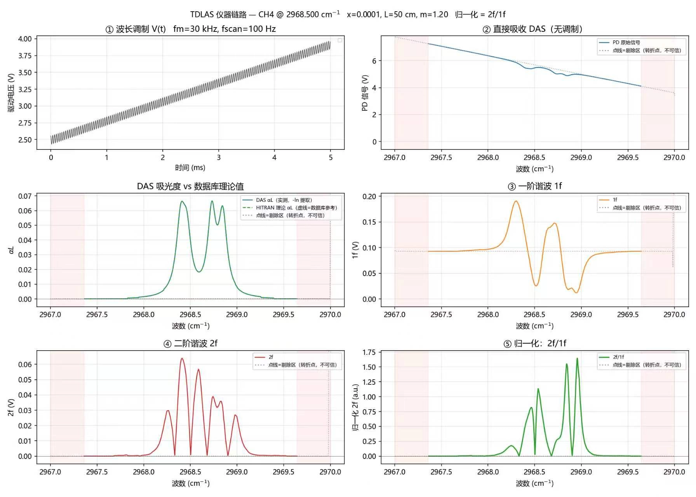
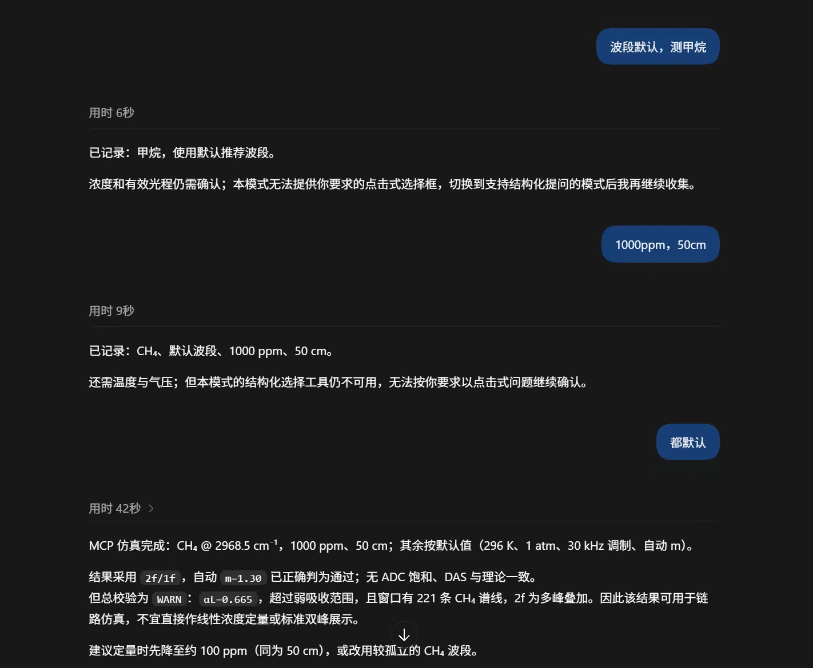
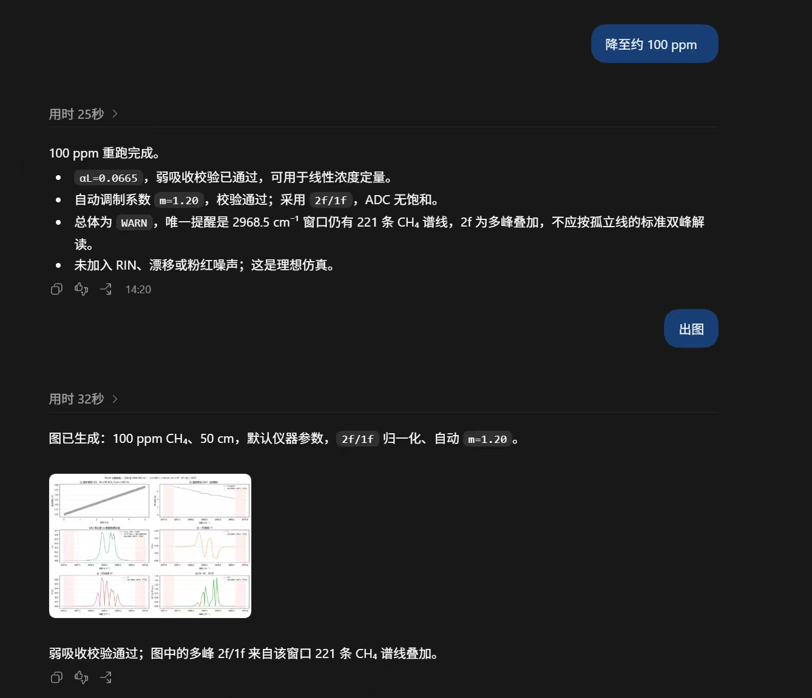
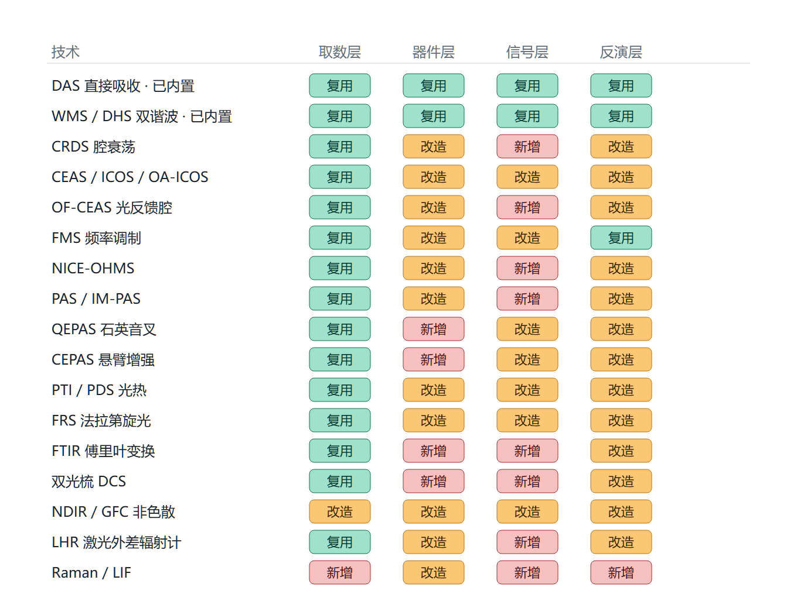

<div align="center">

<h1>tdlas-mcp</h1>

<p><b>TDLAS/WMS 仪器级仿真 MCP 服务器</b><br>
DAQ → 激光 → 光路 → PD → ADC → 数字锁相 · 自然语言驱动</p>


</div>

---

## 📖 概述

tdlas-mcp 是基于 MCP（Model Context Protocol）的可调谐二极管激光吸收光谱（TDLAS）仿真服务器，对实验全链路进行仪器系统级建模：

```
DAQ 电压(三角波+正弦调制) → 激光器调谐 → HITRAN 气体吸收 → 光电探测 → ADC 量化 → 数字锁相 → 1f、2f、2f/1f 谐波提取
```

服务器自包含 HITRAN 线表获取与吸收谱计算模块（基于 HAPI 1.x，无需 API key），通过 MCP 协议接入 AI 助手，以自然语言完成波长调制光谱（WMS）与直接吸收光谱（DAS）仿真。

## 📊 效果展示

### WMS 仪器链路输出（CH₄ @ 2968.5 cm⁻¹）



> 3×2 六子图：① 驱动电压（三角波+正弦调制）→ ② DAS 直接吸收 → ③ 一阶谐波 1f → ④ 二阶谐波 2f → ⑤ 2f/1f 归一化（红色区域为电压折返剔除区）

### 自然语言交互





## 🧭 技术适配矩阵

17 种光谱技术在 tdlas-mcp 四层架构（取数层 / 器件层 / 信号层 / 反演层）上的适配判定：



> 🟩 复用（直接沿用） · 🟧 改造（新增模块或改写） · 🟥 新增（需全新物理内核）

## 🚀 快速上手

```bash
pip install -r requirements.txt

# 服务器自检
python tools/tdlas_mcp.py --selftest

# 接入 MCP 客户端（stdio）
# 将 mcp.config.example.json 中 args 路径改为实际安装路径即可
```

> 💡 **一键配置**：将以下内容复制粘贴给你的 AI 助手，即可自动完成 MCP 接入：
>
> ```
> 请帮我配置 tdlas-mcp MCP 服务器，本地路径 <你的 tdlas-mcp 安装路径>，
> Python 解释器路径 <你的 python.exe 路径>，
> 入口文件 tools/tdlas_mcp.py。
> ```
>
> 同时建议将 [SKILL.md](./SKILL.md) 作为独立 Skill 安装，使 AI 读取完整交互协议与出图规范。

## 🔧 工具列表

| 工具 | 功能 |
|------|------|
| ⭐ **tdlas_wms_instrument** | **WMS 仪器级仿真首选**：全链路建模，输出标准 3×2 六子图 |
| tdlas_das_instrument | 仪器级 DAS 仿真（DAQ→激光→光路→PD→ADC） |
| tdlas_simulate | 解析模型正向计算：DAS 透过率、1f、2f 峰高 |
| tdlas_das_chain | 三角波 DAS 链路：PD 原始信号 → 多项式基线拟合 → 吸光度 |
| tdlas_review | 结果自动校验（9 项检查，不绘图） |
| tdlas_invert | 免标定浓度反演：2f/1f 峰高 → 摩尔分数 |
| tdlas_detection_limit | 噪声等效浓度（NEC）与检测限（LOD）计算 |
| tdlas_detection_limit_scan | LOD 随光程与参考浓度的二维扫描（系统选型） |
| tdlas_session | 跨会话工况参数持久化 |
| tdlas_device | 硬件参数库管理（激光器/探测器/DAQ/光学） |
| tdlas_guide | AI 交互协议与术语表 |
| tdlas_selftest | 全链路自检 |

## 🌐 远程部署

```bash
# HTTP 模式
python tools/tdlas_mcp.py --http --host 0.0.0.0 --port 8000 --token <鉴权密钥>

# 公网隧道（cloudflared）
python tools/remote_link.py
```

配置示例见 [mcp.config.example.json](./mcp.config.example.json)。

## 📚 相关文档

| 文档 | 内容 |
|------|------|
| [TECHNICAL.md](./TECHNICAL.md) | 物理原理、算法实现、参数表、已知近似 |
| [SKILL.md](./SKILL.md) | AI 交互规范与工具使用协议 |
| [CHANGELOG.md](./CHANGELOG.md) | 版本更新记录 |

## 📝 引用

```
The TDLAS/WMS instrument-level simulations were performed using tdlas-mcp
(https://github.com/LKF0402/tdlas-mcp, GPLv3).
```

底层数据：HAPI (Kochanov et al., JQSRT 2016, DOI: 10.1016/j.jqsrt.2016.03.005) · HITRAN2024 (Gordon et al., JQSRT 2026, DOI: 10.1016/j.jqsrt.2026.109807)

## ⚠️ 声明

### 学术诚信

本工具输出为理论仿真结果，**仅用于研究参考、方法验证与系统选型**。严禁将仿真数据冒充实验测量数据写入学术论文，或隐瞒仿真性质误导审稿人与读者。论文中使用本工具时须明确标注"理论仿真"，并按下方引用格式致谢。

### 版权与使用

本项目为**个人独立原创**，以 GPLv3 许可证开源发布：

- ✅ **允许**：个人使用、学术研究、教学、自由修改与二次开发
- ✅ **允许**：商业场景下的内部研究与评估
- ❌ **禁止**：将本项目源码或衍生代码闭源后作为专有软件出售
- ❌ **禁止**：去除版权声明后抄袭、换壳、或冒充原创作品发布
- ❌ **禁止**：直接将仿真结果作为实验数据用于产品认证或商业宣传

GPLv3 的 Copyleft 条款确保任何衍生作品必须同样开源。如果你使用本项目发表成果或将其集成到更大的系统中，请保留原始版权声明并附上本文档链接。

**支持作者**：如果本项目对你有帮助，欢迎 Star、转发、或在论文中引用。这是对个人开发者最直接的支持。

## 📄 许可证

GPLv3 — 详见 [LICENSE](./LICENSE)
