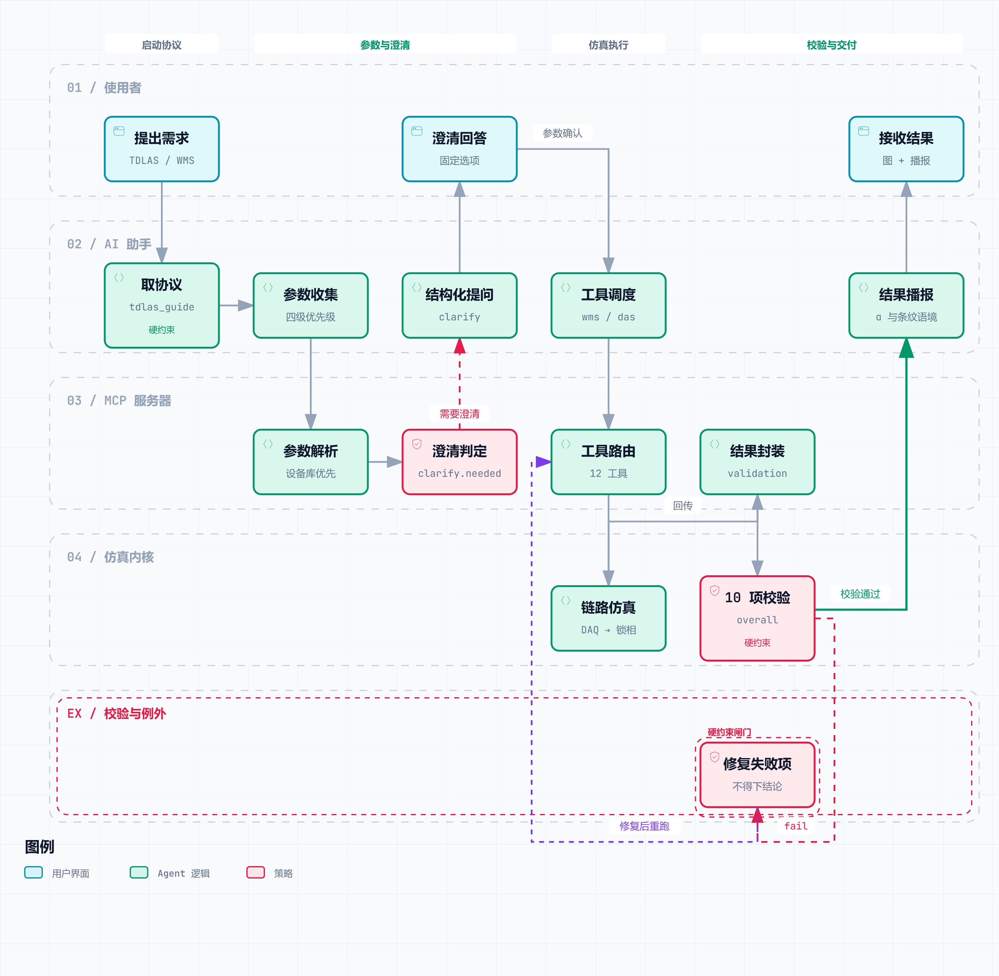

<div align="center">

<h1>tdlas-mcp</h1>

<p><b>TDLAS/WMS 仪器级仿真 MCP 服务器</b><br>
DAQ → 激光 → 光路 → PD → ADC → 数字锁相 · 自然语言驱动 · 无需 API key</p>


</div>

---

## 📖 概述

基于 MCP（Model Context Protocol）的 TDLAS 仿真服务器，对实验**全链路**做仪器级建模（而非只算一条理论 2f 曲线）：

```
DAQ 三角波+正弦调制 → 激光调谐(含二次非线性) → HITRAN 气体吸收 → 光电探测 → ADC 量化 → 数字锁相 → 1f / 2f / 2f·1f⁻¹
```

内置 HITRAN 取数与吸收谱计算（HAPI 1.x，**不需要 API key**），由 AI 助手以自然语言驱动 WMS / DAS 仿真。用途：**系统选型、方法验证、排除错误设计**——不替代实测。

## ✨ 核心特性

- **全链路建模**：DAQ 调制 → 激光调谐 → HITRAN 吸收 → PD → ADC → 数字锁相；可选 etalon 条纹、RIN、1/f 漂移、RAM/AM
- **混合气多组分**：`mixture` 严格按 `α = Σ xᵢ·α_pureᵢ(T,P)` 逐点相加（**不用 x·P 当分压**），并返回各组分归因
- **AI 交互契约**：返回值携带 `interaction` 与机器可读的 `next_required_actions`——"必须澄清 / 必须披露"由返回值承载
- **保真度台账**：默认生效 11 项 / 需显式开启 6 项 / **未建模 7 项**，未建模项随结果披露
- **可信度分层**：10 项物理校验与交互合规**分别**计分
- **可复现 + 离线门禁**：`seed=0` 逐位可复现；契约自检 147 项与保真度审计均为 CI 硬门禁（不依赖网络）

其他：`return_xy` 透出锁相 X/Y 用于 RAM/AM 诊断；`tdlas_invert(n_repeats>0)` 给测量不确定度（仅统计分量）；`x_list` 多浓度同图。细节见 [TECHNICAL.md](./TECHNICAL.md) 与 [docs/VALIDATION.md](./docs/VALIDATION.md)。

## 📊 效果展示


> CH₄ @ 2968.5 cm⁻¹ 的 3×2 输出：驱动电压 → DAS 吸收 → 1f → 2f → 2f/1f（红色为电压折返剔除区）



> 四泳道流程：启动协议 → 参数与澄清（四级优先级 + 设备库 + 结构化追问）→ 仿真执行 → 校验与交付（10 项校验、α/条纹语境播报、未建模效应披露）

<details>
<summary>技术适配矩阵（扩展性）</summary>

17 种光谱技术在本项目四层架构（取数 / 器件 / 信号 / 反演）上的适配判定：🟩 复用 · 🟧 改造 · 🟥 新增


</details>

## 🚀 快速上手

```bash
pip install -r requirements.txt

python tools/tdlas_mcp.py --selftest      # 服务器自检（需访问 hitran.org）
python tools/contract_check.py            # 离线契约自检（CI 硬门禁）
python tools/tdlas_fidelity.py            # 离线保真度审计（CI 硬门禁）
python tools/alpha_crossval.py            # α(ν) 独立交叉校验（与 HAPI 互校）
```

接入 MCP 客户端：把 `mcp.config.example.json` 里的路径改为本机路径即可。

> 💡 **一键配置**：复制下面这段话给你的 AI 助手 ——
> "请帮我配置 tdlas-mcp MCP 服务器，本地路径 `<安装路径>`，Python 解释器 `<python.exe 路径>`，入口文件 `tools/tdlas_mcp.py`；并把本项目 `SKILL.md` 安装为 Skill。"

## ⚠️ Skill 不是可选项

`SKILL.md` 不是文档，而是 **AI 的行为规范**：服务器只能保证 AI「看到」`next_required_actions`，Skill 才规定 AI「照做」——保留默认值必须显式标注、器件参数来源（`source`）必须如实填写、设备命名须含型号/波长。

安装（任选其一）：放进客户端的 Skill 目录；或让 AI 直接读取该文件作为行为规范。

## 🔧 工具列表

| 工具 | 功能 |
|---|---|
| ⭐ **tdlas_wms_instrument** | **WMS 仪器级仿真首选**：全链路建模，输出标准 3×2 六子图 |
| tdlas_das_instrument | 仪器级 DAS 仿真（DAQ→激光→光路→PD→ADC） |
| tdlas_simulate | 解析模型正向计算：DAS 透过率、1f、2f 峰高 |
| tdlas_das_chain | 三角波 DAS 链路：PD 原始信号 → 基线拟合 → 吸光度 |
| tdlas_review | 结果自动校验（10 项，不绘图）+ 交互契约与保真度声明 |
| tdlas_invert | 免标定浓度反演（2f/1f → 摩尔分数）；`n_repeats>0` 给出不确定度 |
| tdlas_detection_limit | 噪声等效浓度（NEC）与检测限（LOD） |
| tdlas_detection_limit_scan | LOD 随光程 / 参考浓度的二维扫描（选型） |
| tdlas_session | 跨会话工况参数持久化 |
| tdlas_device | 硬件参数库（激光器 / 探测器 / DAQ / 光学） |
| tdlas_guide | AI 交互协议、术语表与保真度台账 |
| tdlas_selftest | 全链路自检 |

> 四个仿真工具（及透传的 `tdlas_review`）共用一对可选项：`mixture`（混合气）与 `x_list`（单物种多浓度扫描）。两者**互斥**，且与单 `x` **二选一**。
>
> `x_list` 时**标准 6 子图本身就按浓度叠加**：②~⑤ 面板（PD / αL / 1f / 2f / 归一化 2f）以 viridis 配色叠放各浓度并标 ppm，纵轴按全部浓度统一（低浓度不会被压平）；另有单用途的 `png_overlay` 对照图。

## 🌐 远程部署

```bash
python tools/tdlas_mcp.py --http --host 0.0.0.0 --port 8000 --token <鉴权密钥>
python tools/remote_link.py   # 公网隧道（cloudflared）
```

## 📚 文档

| 文档 | 内容 |
|---|---|
| [TECHNICAL.md](./TECHNICAL.md) | 物理原理、算法实现、参数表、已知近似 |
| [docs/VALIDATION.md](./docs/VALIDATION.md) | 可信度分层、校验判据口径、已知局限 |
| [SKILL.md](./SKILL.md) | AI 交互规范与工具使用协议 |
| [tools/tdlas_fidelity.py](./tools/tdlas_fidelity.py) | 保真度登记表：单一真源 + 离线审计 |
| [CHANGELOG.md](./CHANGELOG.md) | 版本更新记录 |

## 📝 引用

```
The TDLAS/WMS instrument-level simulations were performed using tdlas-mcp
(https://github.com/LKF0402/tdlas-mcp, GPLv3).
```

底层数据：HAPI (Kochanov et al., JQSRT 2016, [10.1016/j.jqsrt.2016.03.005](https://doi.org/10.1016/j.jqsrt.2016.03.005)) · HITRAN2024 (Gordon et al., JQSRT 2026, [10.1016/j.jqsrt.2026.109807](https://doi.org/10.1016/j.jqsrt.2026.109807))

## ⚠️ 声明

**学术诚信**：输出为**理论仿真**，仅用于研究参考、方法验证与系统选型。严禁将仿真结果冒充实验测量写入论文或用于产品认证；论文中使用须标注"理论仿真"并按上节致谢。

**版权**：个人独立原创，GPLv3 开源。✅ 个人/学术/教学/二次开发、商业内部研究评估；❌ 闭源出售、去除版权声明后换壳抄袭、把仿真结果当实验数据宣传。衍生作品须同样开源并保留原始版权声明。

**支持作者**：Star、转发或引用，是对个人开发者最直接的支持。

## 📄 许可证

GPLv3 — 详见 [LICENSE](./LICENSE)
